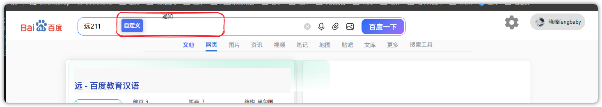

# 百度双列窄窗口布局 Bug 修复

原版项目地址：https://github.com/langren1353/GM_script

## Bug 截图



## Bug 表现

在百度搜索结果页开启双列/多列样式后，如果浏览器窗口宽度被调窄，顶部工具区会发生错位。

具体表现：

- “自定义”按钮被挤到搜索框上方或中间。
- 百度原生“通知”入口仍在顶部工具区内占位。
- `#u`、`#myuser` 等外层容器可能覆盖搜索框，导致点击搜索框困难或无法输入。
- 窄窗口下排版混乱，搜索栏使用体验明显受影响。

## 产生原因

原脚本会把“自定义”按钮插入百度顶部工具区 `#u`：

```js
parent.insertBefore(userAdiv, parent.childNodes[0]);
```

同时原样式对 `#u` 使用了全局固定宽度：

```css
#u {
  width: 319px;
}
```

百度新版搜索页的 `#u` 内还包含通知、设置、账号等元素。开启双列样式并缩窄窗口后，`#u` 内部元素空间不足，导致“自定义”和“通知”被挤到搜索框区域。

另外原代码使用：

```js
parent.style = "width: auto;";
```

这会覆盖 `#u` 可能已有的 inline style，进一步增加布局不稳定性。

## 修复内容

修改文件：

```text
AC-Baidu-SoGou-Google-NoRedirect.user.js
```

修复点：

- 只修改 `parent.style.width`，不覆盖整个 `style`。
- 将 `#u{width:319px}` 限制为非百度页。
- 百度页下让 `#u` 和 `#myuser` 外层不拦截鼠标事件，避免挡住搜索框。
- 百度页下让“自定义”按钮使用 `position: fixed`，脱离 `#u` 横向排版。
- 根据窗口宽度调整“自定义”按钮位置。
- 隐藏百度原生 `.message-center-wrapper` 通知入口，避免继续占位挤压布局。

核心修复逻辑：

```css
body.baidu #u {
  pointer-events: none !important;
}

body.baidu #u > * {
  pointer-events: auto !important;
}

body.baidu #u .message-center-wrapper {
  display: none !important;
}

body.baidu #u #myuser {
  position: fixed !important;
  top: 54px !important;
  right: 220px !important;
  z-index: 100000 !important;
  pointer-events: none !important;
}

body.baidu #u #myuser .myuserconfig {
  pointer-events: auto !important;
}
```

## 验证

```bash
node --check AC-Baidu-SoGou-Google-NoRedirect.user.js
```

检查通过。
