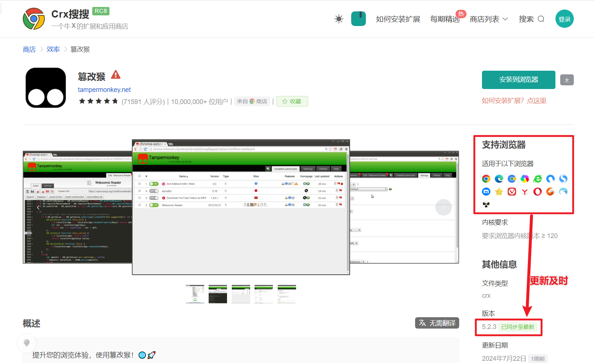
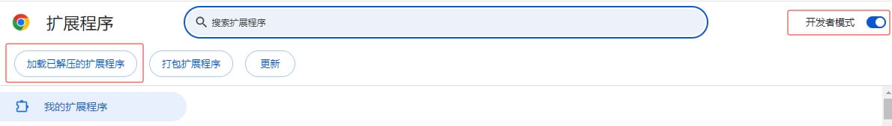

---
head:
  - - meta
    - name: keywords
      content: AC-Baidu,脚本安装教程,AC-Baidu优化脚本,百度优化脚本,谷歌优化脚本,必应优化脚本,搜索优化脚本,搜索结果优化,搜索结果
---
# 安装详解

> 安装脚本前需先安装 [油猴插件](https://www.tampermonkey.net).
> [油猴插件说明](https://www.baidu.com/s?wd=%E6%B2%B9%E7%8C%B4%E6%8F%92%E4%BB%B6%E5%AE%89%E8%A3%85) 是一款广受好评的、用于加载用户脚本的浏览器插件，支持：Chrome、Edge、Firefox、safari、Opera、以及[国内品牌众多的浏览器](https://www.baidu.com/s?wd=%E5%9B%BD%E5%86%85%E6%B5%8F%E8%A7%88%E5%99%A8).

**安装好油猴插件后**, 点击下面的链接即可一键安装：:

- **[AC-Baidu.user.js (ScriptCat-前往安装)](https://scriptcat.org/zh-CN/script-show-page/3002)**
- **[AC-Baidu.user.js (GreasyFork-被墙了-前往安装)](https://greasyfork.org/zh-CN/scripts/14178)**
- 针对greasyfork无法访问，走代理即可：[**`一元机场.PLUS`**](https://v.xn--4gq62f52gdss.plus/b/?code=g4WEkq4j)


如果你是第一次接触，各种情况下安装油猴(Tampermonkey)的方法如下：

## 1. 国产浏览器安装（百分浏览器、360极速浏览器等）
> 由于国产浏览器对油猴(Tampermonkey)的支持情况不同，所以安装方式也不同，这里以360或百分浏览器为例，其他国产浏览器安装方式类似
### 1. 使用自己的商店、插件中心安装
> 这种方式比较简单，直接在浏览器中搜索“油猴”或者“Tampermonkey”即可找到，然后点击安装即可。

### 2. 使用公有插件中心安装
> 这种方式需要打开`CRX搜搜`：[Crx搜搜](https://www.crxsoso.com/)，然后再搜索“油猴”或者“Tampermonkey”即可找到，然后点击安装即可。
> 但是需要根据具体的浏览器来进行选择，我这里给一个安装地址：[Tampermonkey](https://www.crxsoso.com/webstore/detail/dhdgffkkebhmkfjojejmpbldmpobfkfo)



## 2. 非国产浏览器安装（Chrome、Edge等）

> 正常安装油猴(Tampermonkey)，只需通过官网或者应用商店安装即可，但国内很多时候下面的链接不一定能打得开，则需要参考下面得国内安装方法。

油猴官网： [https://www.tampermonkey.net](https://www.tampermonkey.net)
你可以通过官网的说明进行下载安装，或者通过各大浏览器的应用商店安装。

如果你的网络能打开下面应用商店的地址，则直接安装即可：

- [Tampermonkey - Chrome 应用商店](https://chrome.google.com/webstore/detail/dhdgffkkebhmkfjojejmpbldmpobfkfo)
- [Tampermonkey - Edge 应用商店](https://microsoftedge.microsoft.com/addons/detail/iikmkjmpaadaobahmlepeloendndfphd)
- [Tampermonkey - Firefox 应用商店](https://addons.mozilla.org/en-US/firefox/addon/tampermonkey/)
- [Tampermonkey - Safari 应用商店](https://apps.apple.com/us/app/tampermonkey/id1482490089)
- [Tampermonkey - Opera 应用商店](https://addons.opera.com/en/extensions/details/tampermonkey-beta/)

安装好油猴(Tampermonkey)插件后，点击下面的链接即可完成脚本的安装：

- **[AC-Baidu.user.js (ScriptCat-前往安装)](https://scriptcat.org/zh-CN/script-show-page/3002)**
- **[AC-Baidu.user.js (GreasyFork-被墙了-前往安装)](https://greasyfork.org/zh-CN/scripts/14178)**

### 不能上谷歌怎么办？
一个优秀的互联网爱好者、一个专业的网上冲浪的人应该有足够的能力去遨游更广阔的天空。

真正的互联网探索者不会因此迷失方向。就像深海潜水员不会因表面的波涛而停止探索，真正的网络冲浪者早已掌握了更深层的技能，善于构建知识体系的人，终将在信息的暗河中找到属于自己的航向

这里推荐几个能够科学访问的加速器，具体使用方法自查：[**`一元机场.WIKI`**](https://www.xn--4gq62f52gdss.wiki/3-link-sites/choose-price.html)

## 3. 其他方式-离线安装（主要针对Chrome）

> 国内由于网络环境的原因，很多时候并不能通过浏览器的应用商店直接安装，这个时候只能通过离线安装的方式来安装油猴(Tampermonkey)。

下面是油猴(Tampermonkey)的离线安装包，将离线包下载回来，然后通过浏览器的扩展程序页面进行安装即可。

### 第一步：下载离线包

Tampermonkey离线包的官方地址，可能没法访问，如果不行则用下面的网盘地址，如果可以请优先使用官方地址：

- [Tampermonkey 离线包](https://data.tampermonkey.net/tampermonkey_stable.crx)

国内能访问的网盘文件地址： 蓝奏云

- [Tampermonkey.crx - 蓝奏云](https://wwt.lanzouq.com/izahN1p5e0pg) 提取密码: fn2o
- [Tampermonkey.crx - 百度云](https://pan.baidu.com/s/1ErjSyfI4W2mop1b452j1CQ?pwd=ayi3) 提取密码: ayi3

如果你用的是360极速浏览器等国产浏览器，此时只需将下载好的离线包拖拽到浏览器窗口即可完成安装。

如果不是，或者直接拖拽进去没法安装，那么请继续下面的步骤。

### 第二步：开启开发者模式

你可以通过菜单选项或者地址栏输入`chrome://extensions/`来打开浏览器的扩展程序页面，然后打开开发者模式。


### 第三步：解压离线包并加载安装

下载回来的离线包，本质上是一个tar的压缩包，window下将文件名后缀改为`.zip`，然后通过zip或rar等解压工具就能解压出来（建议解压到D盘的某个目录中去，例如D:\ChromeExtensions），再去扩展程序页面点击`加载已解压的扩展程序`，选择解压出来的文件夹即可完成安装。

如果是macOS或者linux系统，可以通过命令行解压，然后通过扩展程序页面加载安装。

```bash
# 注意文件名要根据实际情况修改
tar -xvf tampermonkey_stable.crx
```

### 第四步：安装AC-Baidu增强脚本
- **[AC-Baidu.user.js (ScriptCat-前往安装)](https://scriptcat.org/zh-CN/script-show-page/3002)**
- **[AC-Baidu.user.js (GreasyFork-被墙了-前往安装)](https://greasyfork.org/zh-CN/scripts/14178)**
