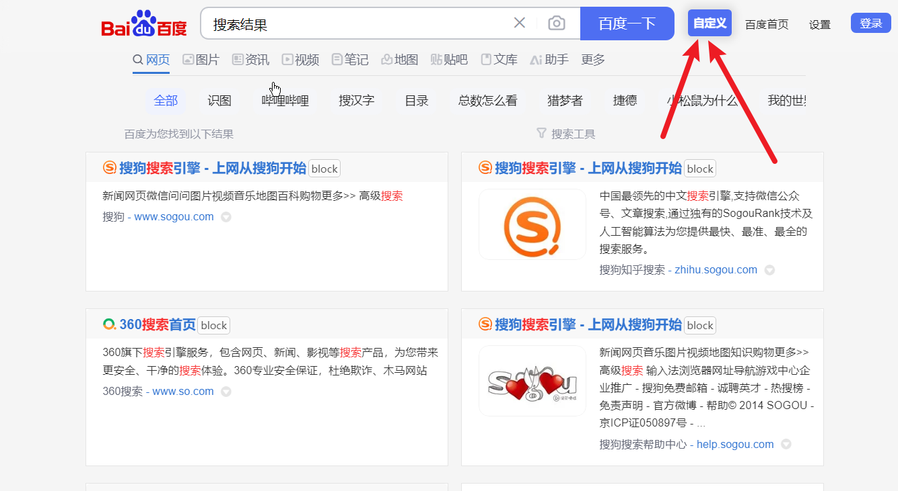
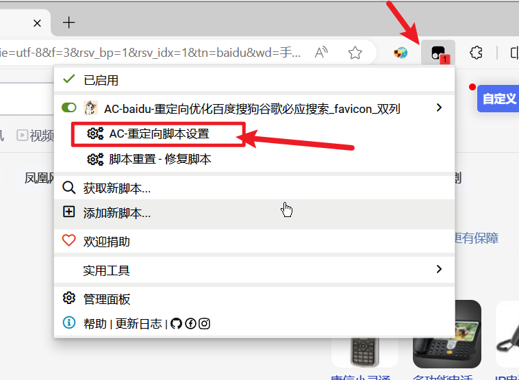

---
head:
  - - meta
    - name: keywords
      content: AC-Baidu,配置项说明,AC-Baidu优化脚本,百度优化脚本,谷歌优化脚本,必应优化脚本,搜索优化脚本,搜索结果优化,搜索结果
---
# 设置开启

### 设置面板可以通过搜索引擎中的自定义按钮打开 {#open}
> 1. 设置按钮一般在`搜索结果页面右上角`，可以在`百度`、`谷歌`、`Bing`结果页右上角找到这个

> 2. 设置也可以通过油猴的下拉展开

# 设置手册

## 主功能-处理重定向(按需开启) {#redirect}
> 1. 重定向是浏览器为了防止爬虫，进而对用户进行重定向，防止爬虫爬取到不必要的数据，但是实际上对我们用户的体验并不友好，所以我们需要对重定向进行处理
> 2. 此功能为非必须开启项目，对于页面显示效果无帮助
> 3. 此功能为拦截功能的前置条件，否则拦截功能几乎无法使用

状态     | 结果
-------- | -----
勾选-开启  | 处理重定向、提供拦截支持
不勾选  | 默认状态（原始链接、无拦截功能支持）

## 附加1-去广告功能(按需开启) {#ads}
> 1. 去广告功能为非必须开启项目，一般建议开启，因为广告过多会影响用户体验
> 2. 去广告功能一定程度上能防止广告滥用导致的用户无法辨别真实网站的问题
> 3. 去广告主要针对页面中`明确标记为广告`的元素
> 4. 去广告功能无法针对未标记为广告的元素，因为机器无法判定是否为广告，甚至人工都不能
> 5. 去广告功能默认不开启，防止影响原搜索引擎的搜索结果

状态     | 结果
-------- | -----
勾选-开启  | 删除页面中明确标记为广告的元素
不勾选  | 默认状态（不做处理）

## 附加2-自动翻页功能(按需开启) {#pager}
> 1. 自动翻页功能为非必须开启项目，一般建议开启，因为自动翻页能提升用户体验
> 2. 翻页原理源自：[【Super-preloader】](https://github.com/machsix/Super-preloader)，一个存在可能将近12-15年多的脚本，远强大于本脚本，建议可以安装

状态     | 结果
-------- | -----
勾选-开启  | 进行自动翻页处理
不勾选  | 默认状态（不做处理）

## 附加3-Favicon功能(建议开启) {#favicon}
> 1. 将搜索结果的每一行的Favicon显示在每一个项的左边
> 2. 效果就是提升显示画面效果，技术原理来自yandex-Favicon
> 3. 默认图标一般不用变更

 状态     | 结果
 -------- | -----
 勾选-开启  | 开启搜索结果Favicon显示
 不勾选  | 默认状态（不做变更）

## 附加4-显示搜索右侧栏结果(建议开启) {#remove-right}
> 1. 搜索引擎右侧结果一般为搜索的相关内容推荐，属于搜索引擎的搜索增强功能，一般不做关闭
> 2. 但是双列情况下，右侧栏必然会被关闭掉（否则没有多余空间来做双列功能）
> 3. 此功能按需开启

 状态     | 结果
 -------- | -----
 勾选-开启  | 开启搜索结果右侧栏（不做变更）
 不勾选  | 搜索的结果页面没有右侧栏

## 附加5-编号功能(不建议开启) {#number}
> 1. 该功能属于历史遗留功能，目前没有有一定的严重问题
> 2. 主要问题在于编号可能不连续，很可能前面1-10，之后就是13开始了，会有部分丢失的编号

 状态     | 结果
 -------- | -----
 勾选-开启  | 搜索结果带编号
 不勾选  | 默认状态（不做变更）

## 附加6-文字下划线(不建议开启) {#text-line}
> 1. 搜索的超链接带下划线，一般建议关闭，因为下划线会干扰显示效果

 状态     | 结果
 -------- | -----
 勾选-开启  | 超链接显示带下划线
 不勾选  | 超链接不带下划线

## 附加7-暗黑主题启用(按需开启) {#darkmode}
> 设置后将启用暗黑主题下的兼容

 状态     | 结果
 -------- | -----
 勾选-开启  | 启用暗黑模式
 不勾选  | 不启用暗黑模式，可能会出现白块问题

## 护眼色配置(按需开启) {#huyan}
> 1. 护眼功能针对不同的展开来进行开启，默认为关闭
> 2. 可以选择护眼的颜色
> 3. 护眼的功能可能存在不兼容、或者失去兼容的可能，所以请自行测试
> 4. 护眼插件建议使用：DarkReader

 状态     | 结果
 -------- | -----
 勾选-开启  | 开启护眼功能，进行页面自适应颜色
 不勾选  | 默认状态（不做变更）

## 移除百度搜索预测(建议必须开启) {#remove-baidu}
> 1. 该功能为删除`百度搜索预测`，百度搜索预测会导致脚本无法动态失效
> 2. 所以如非必要，一般保持开启

 状态     | 结果
 -------- | -----
 勾选-开启  | 百度搜索不带预测功能
 不勾选  | 默认状态（不做变更）

## 自主拦截域名(按需开启) {#block}
> 1. 自主拦截域名功能为非必须开启项目，开启后提供拦截的能力
> 2. 可以直接点击搜索项后面的`Block`键，进行拦截
> 3. 拦截中也可以点击`DIY`按钮，手动拦截，拦截规则采用正则表达式
> 3. 还有`隐藏结果`能将拦截到的结果直接隐藏，避免影响搜索查看
> 4. `隐藏Block按钮`用于隐藏`Block`键

 状态     | 结果
 -------- | -----
 勾选-开启  | 开启拦截功能，增加`Block`键
 不勾选  | 默认状态（不做拦截）

## 自定义样式表-支持Less.js (按需开启) {#customcss}
> 1. 提供不同站点的自定义样式效果，主要针对单列、双列等，具体效果自测
> 2. 提供背景图功能，可以自定义背景图，背景图会自动使用窗口大小
> 3. 默认提供了背景图，但是需要手动开启

